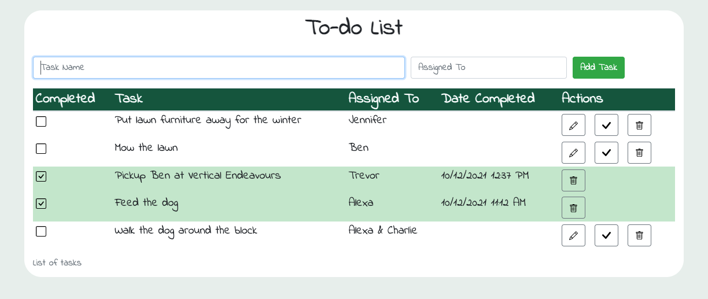

# To-do List

## Description

The objective of this stretch weekend challenge was to build a to-do list that uses all of the full stack frameworks and technologies that we have learned during out first 10 weeks at Prime Digital Academy. The to-do list should have a front-end that allows a user to enter a task and save it to a relational database. The user should also be able to delete a task on the front-end and the task will be deleted from the database.
There should be a clear indication that the task was completed. In this case, I changed the background color of the row to green and showed a checkmark under the 'Completed' column.

I customized the requirements a little bit in order to have the application be used by more than one person. For example, a group of roomates or a family could use the application in order to keep track of tasks assigned to each person in the household. Specifically, I added:

- ability to assign a person to the task
- ability to edit a task and the person assigned to it.

## Screen Shot

### Prerequisites

The following should be installed before attempting to use the to-do list:

- [Node.js](https://nodejs.org/en/) - javascript runtime
- [Express](https://expressjs.com/en/starter/installing.html) - a web framework for Node.js
- [Postgresql](https://www.postgresql.org/) - an open source relational database

## Installation

In order to get the to-do list up and running, do the following:

1. Download code locally from github.
2. Create the database and corresponding table:

- Using your favorite relational database client (I use Postico(<https://eggerapps.at/postico/>), go to the area/tab that allows you to run a query. Run the query found in the *Create database.sql* file. This will create the weekend_to_do_app database.
- Then, within the weekend_to_do_app database, run the query found in the *Create table tasks.sql* file. This will create the tasks table.

3. Launch the application locally.

- Go to your terminal and type 'npm start'. This will start a local server on port 5000.
- Go to your web browser and type 'localhost:5000'. This will bring up the to-do list.

## Usage

1. A user can create a new task by entering a task name(required) and assigning a person to the task. The task is saved to the database by clicking on the 'Add Task' button. The list of tasks is updated with the new task.

2. A user can edit the task by clicking on the pencil button. This will launch a popup that will allow the user to enter a new task name and a new person assigned to the task. After clicking the "ok" button, the list of tasks will be updated with the changes. The database will also have the update.

3. A user can complete a task by clicking on the checkmark button. This will change the background color of the row to green and also place a checkmark box under the column "Completed". A timestamp will be displayed under the "Date Completed" column.

4. A user can also delete a task from the list. This is done by clicking on the garbage button. The task will be deleted from the database.

## Built With/Using

- HTML
- CSS
- Bootstrap
- Sweetalert2
- JavaScript
- Node.js
- AJAX
- Express
- Postgresql

## Acknowledgement

- Thanks to our instructor, Dev Jana. He makes lecture time interesting and creates an environment that feels safe and encourages curiosity.
- Thanks to [Prime Digital Academy](www.primeacademy.io) for providing all Prime students with the opportunity to make substantial changes in their lives by learning how to program and how to think like a programmer.

## Support

- Thank you to my fellow Ionian cohort members. We are continuously pushing each other to learn as much as possible and enjoy the process while we do it!
- Thank you (again) to my kids for testing out my to-do list. 

If you have suggestions or questions, please email me at <jenny_alexander@icloud.com>.